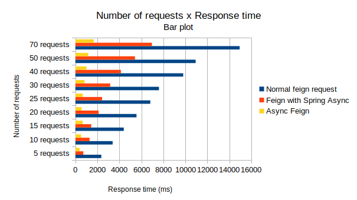
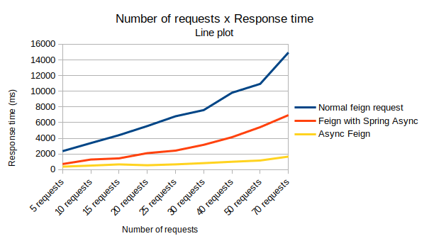

# Optimizing response time for group requests

This repository makes a comparison between the ways to implement clients for requests to other services using Spring Framework and the Feign library.

## Problem:

Sometimes, it is necessary to make many requests to APIs in the same process. The simplest way to do this is to send procedural requests, one after the other. It turns out that when there is a group of requests that do not depend on each other, this time could be better used.

## Alternatives to optimize the process:

Parallelize! Making the most requests at the same time, as far as possible, can be a great way to reduce the response time.

## Why Feign:

The implementation of Feign is a simplified way to integrate services via REST. Popularized because of the Spring Cloud, it has gained adherence by the community for many factors, among them the benefit of keeping the code less verbose.

## Implementations:

For comparative purposes, three implementations were made: **1 - *normal way, making requests in sequence, waiting for the result of the last one to proceed***; **2 - *using Spring's [@Async module](https://spring.io/guides/gs/async-method/), where it handles each request asynchronously***; **3 - *using the new [AsyncFeign](https://github.com/OpenFeign/feign#async-execution-via-completablefuture) module available in the latest version of the library***.

### Normal way, making requests in sequence

```java
for (int i = 0; i < requestNumber; i++) {
  DeckViewDTO deck1 = deckFeignClient.newDeck();
  logger.info("[DECK] new deck with key " + deck1.getDeckId());
}
```

### Using Spring's @Async module

```java
List<CompletableFuture<DeckViewDTO>> decks = new ArrayList<CompletableFuture<DeckViewDTO>>();

for (int i = 0; i < requestNumber; i++) {
  var aux = i + 1;
  logger.info("[DECK] requesting deck " + aux);
  decks.add(asyncSevice.getAsyncDeck());
}

for (int i = 0; i < requestNumber; i++) {
  logger.info("[DECK] new deck with key " + decks.get(i).get().getDeckId());
}
```

### Using the new AsyncFeign module

```java
DeckAsyncFeignClient deckAsyncFeign = AsyncFeign.asyncBuilder()
          .decoder(new JacksonDecoder())
          .target(DeckAsyncFeignClient.class, "https://deckofcardsapi.com/api");

List<CompletableFuture<DeckViewDTO>> decks = new ArrayList<CompletableFuture<DeckViewDTO>>();

for (int i = 0; i < requestNumber; i++) {
  var aux = i + 1;
  logger.info("[DECK] requesting deck " + aux);
  decks.add(deckAsyncFeign.newDeck());
}

for (int i = 0; i < requestNumber; i++) {
  logger.info("[DECK] new deck with key " + decks.get(i).get().getDeckId());
}
```

## Results:

The target of requests was the [Deck of Cards API](https://deckofcardsapi.com/), widely used in simulations and tests. At the time the tests were done, a simple request at the target endpoint had an average response time of **360 milliseconds**.

To perform the tests, cross analyzes were performed. For each implementation, operations were carried out with groups of **5**, **10**, **15**, **20**, **25**, **30**, **40**, **50** and **70** requests. Talk about making Http requests, [Postman](https://www.postman.com/) was used. The response times below are in milliseconds:

|             | Normal feign request | Feign with Spring Async | Async Feign |
| ----------- | -------------------- | ----------------------- | ----------- |
| 5 requests  | 2360                 | 720                     | 387         |
| 10 requests | 3390                 | 1291                    | 522         |
| 15 requests | 4400                 | 1443                    | 673         |
| 20 requests | 5560                 | 2110                    | 566         |
| 25 requests | 6810                 | 2430                    | 677         |
| 30 requests | 7600                 | 3170                    | 834         |
| 40 requests | 9810                 | 4140                    | 1009        |
| 50 requests | 10940                | 5420                    | 1169        |
| 70 requests | 14940                | 6960                    | 1669        |

The results showed a very good response time using AsyncFeign. While Spring's native way of asynchronism ensured half the response time compared to common requests, AsyncFeign was clearly better than both.

The difference between the results becomes even more visible when observed by the following graphs:




## Conclusions:

Despite being released recently, the builder AsyncFeign, has shown to be quite promising for cases like this. it seems the community is committed to making its implementation as stable as possible.